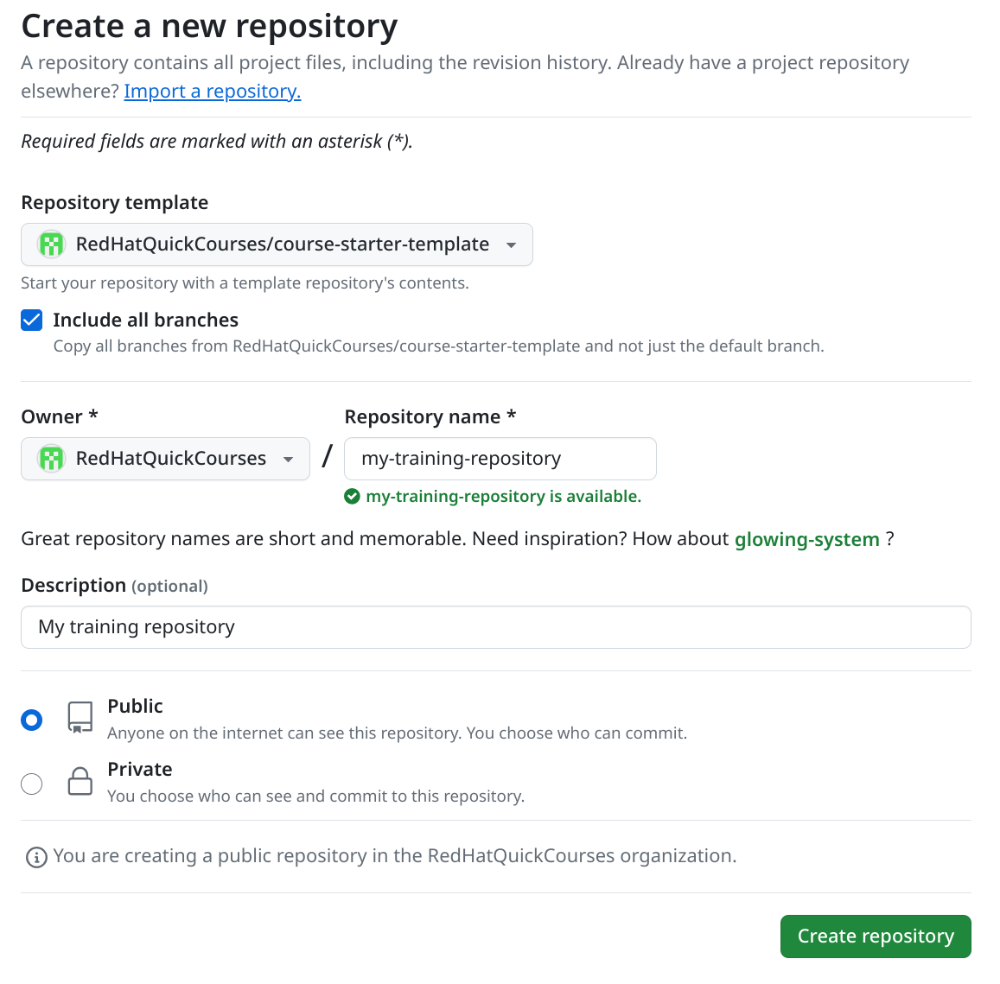
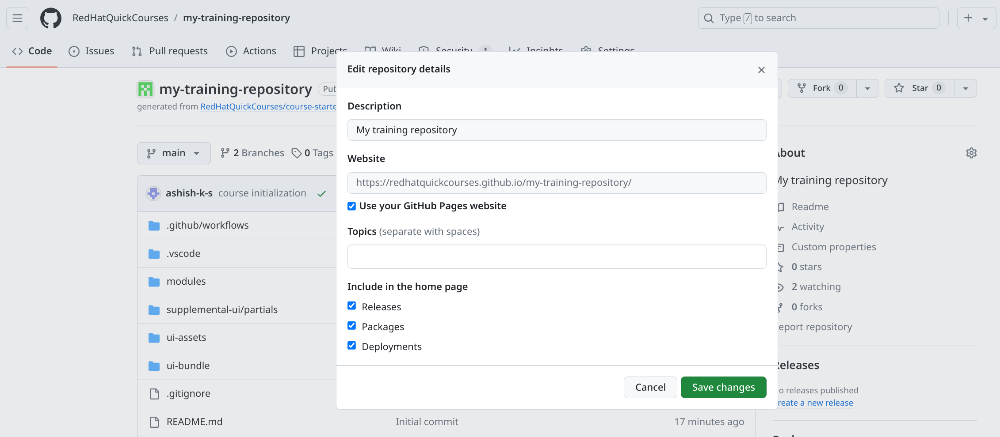
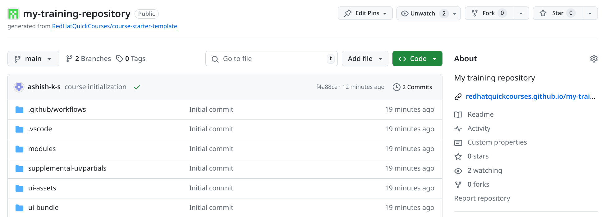
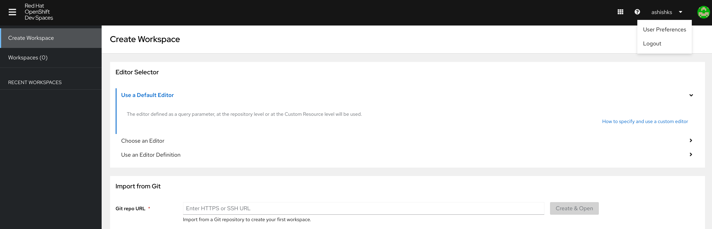
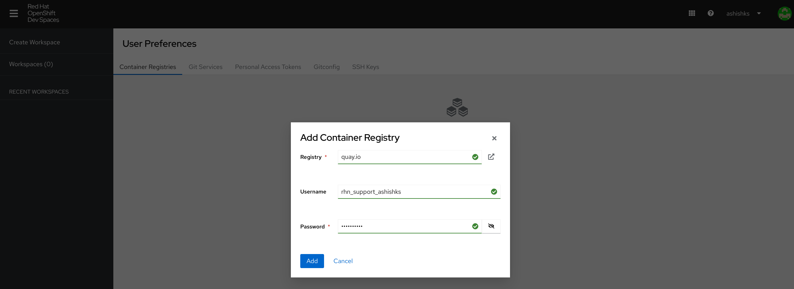
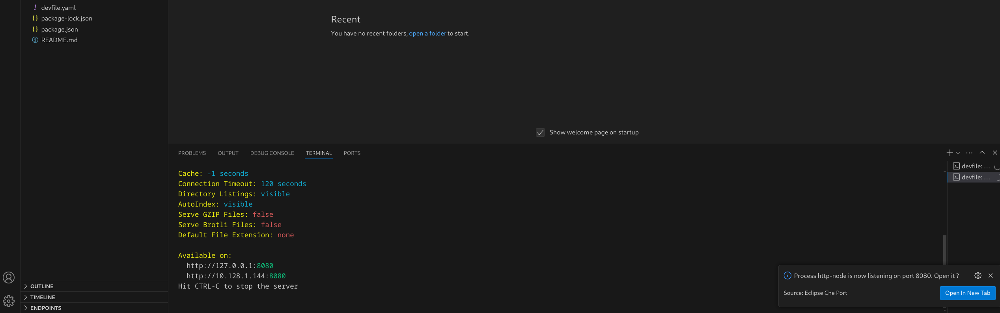

## Getting started with a new training content repository

- Open the [course-starter-template](https://github.com/RedHatQuickCourses/course-starter-template)

- Click on `Use This template` button and select `Create a new repository` option.

- On `Create a new repository` page, Select the options as highlighted in the below image and then click `Create repository` button at the bottom of the page.



- Clone this repository on your local system:
```
git clone git@github.com:RedHatQuickCourses/my-training-repository.git
```
NOTE: Use your repository url in the above command.

- Go in to the course repository directory and initialize the course.
``` 
cd my-training-repository/
sh course-init.sh 
```

Sample output:
```
Initializing my-training-repository . . . done

Please replace the specified strings in the files below and commit the changes before proceeding with the course development.
antora.yml:title: REPLACE Course Title
```

- Edit the files prompted by course initialization script.

- Commit the changes done by course initialization script and your manual edits.
```
 git status 
 git add -A; git commit -m "course initialization"
 git push origin main 
```

- Browse your git repository url 

- On your github repo page, on left hand side pane, click on settings gear icon near `About` heading.

- Click `Use your GitHub Pages website` option to select (checked) it and then click `Save changes` button.



- You should now see the link to access the rendered content within that same block.



FIXME: highlight the relevant area on images.

## Development using devspace 

- Access the devspace url (FIXME: url link)

- Click on `Log in with OpenShift` button.

- Click on `my_htpasswd_provider` option.

- On the next screen, provide your Username and Password for login.

- On the `Authorize Access` page, under `Requested permissions`, mae sure `user:full` option is selected (ticked) and click on `Allow selected permissions` button.

- Configure your `quay.io` credentials on the OpenShift Dev Spaces portal.

- Click your username on top right and click on `User Preferences` option.



- On the `User Preferences` screen under `Container Registries` tab, click on `Add Container Registry` option.

- On the Add Container Registry pop-up provide details as below and the click on `Add` Button.

**Registry:** *quay.io* <br>
**Username:** *your quay.io login* <br>
**Password:** *your quai.io login* password <br>



- Click on `Create Workspace` option on left pane.
Under `Import from Git section, provide the Git repo URL for your training and click on `Create & Open` button.


NOTE: Make sure you have initialized your training content repository and committed the changes before using it in the devspace.

- Click on the search bar for Workspace on top and click on `Run Task` option, then click `devfile`.


- Click on `0-install` option and wait for it to finish.

- Repeat the earlier step to select devfile and click on `1-watch` option this time.

- Repeat the same steps and select `2-serve` option now.

- Pop-up will be displayed at the bottom of the screen.



- Create `Open In New Tab` button.

- On the next pop-up message: `Do you want VS Code - Open Source to open the external website?` click on `Open` button.

- Rendered content will now be displayed in another tab.

- You may continue with your content development in the `vscode` interface provided by devspace.

- When you save your changes in the content files in devspace interface, the changes will be reflected in the rendered content url as soon as you refresh the url.

## Guideline for editing your content

- Browse in to the `modules` directory and edit `adoc` files under `pages` directory to add for your content.

### Add new section in existing chapter

- To create an additional section page, create an `adoc` file for your section page, in the chapter director.
- Add new `xref` line for information about this new section page in `nav.adoc` file under the same chapter directory.


### Add new chapter 

- For additional chapter, create a copy of an existing chapter directory. 
- Change `index.adoc` file with the heading for the new chapter.

Note: You need to modify `antora.yml` file for the new chapter to reflect in your rendered content.
